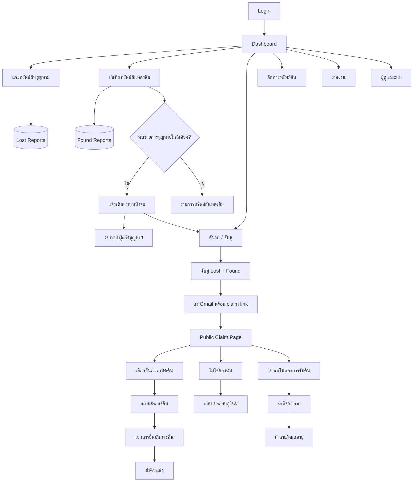
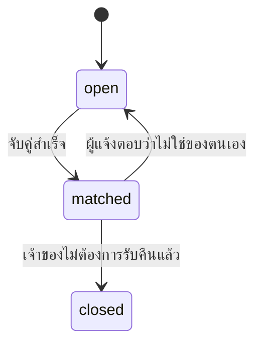
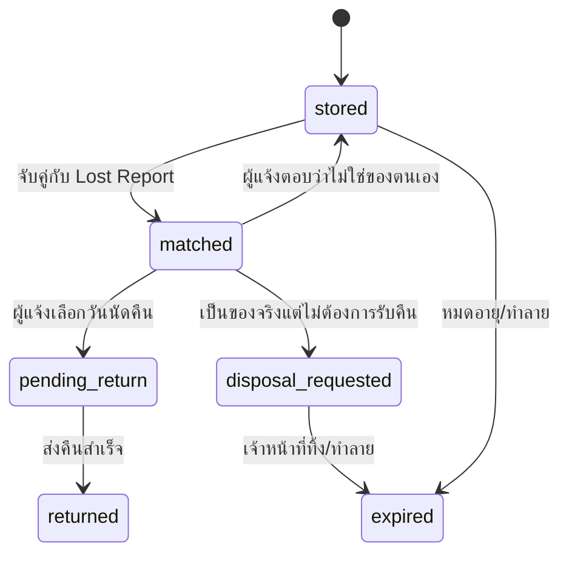

# CNI Lost & Found System - Workflow, System Flow, Data Flow, and AI Change Log

## 1. System Overview

ระบบ CNI Lost & Found เป็นเว็บแอปสำหรับจัดการทรัพย์สินสูญหายและทรัพย์สินหลงลืม โดยครอบคลุมตั้งแต่การแจ้งสูญหาย การบันทึกของพบ การตรวจจับรายการที่ใกล้เคียง การจับคู่ การแจ้งผู้แจ้งสูญหายผ่าน Gmail การนัดวันคืน การลงลายเซ็นอิเล็กทรอนิกส์ และการจัดการสถานะสุดท้ายของทรัพย์สิน

ระบบปัจจุบันเป็น frontend mock application:

- React + TypeScript + Vite
- React Router
- React Context สำหรับ Auth/Data state
- `localStorage` สำหรับเก็บ session user และข้อมูล report/audit เพื่อให้ลิงก์ claim เปิดข้าม tab แล้วยังเจอข้อมูล
- Gmail integration เป็นการเปิด Gmail compose ไม่ใช่ Gmail API ส่งอัตโนมัติ

ข้อจำกัดสำคัญ:

- ยังไม่มี backend/database จริง
- Public claim link อัปเดตข้อมูลใน `localStorage` ของ browser เดียวกัน
- หากต้องใช้งาน production ต้องเพิ่ม backend API, database, authentication token สำหรับ public claim, และ Gmail/OAuth integration จริง

## 2. Main Actors

| Actor | Description | Main Actions |
|---|---|---|
| Admin | ผู้ดูแลระบบ | จัดการผู้ใช้ ข้อมูลหลัก audit settings |
| Staff | เจ้าหน้าที่ Lost & Found | รับแจ้งสูญหาย บันทึกของพบ จับคู่ นัดคืน ส่งคืน จัดการทรัพย์สิน |
| Viewer | ผู้ดูข้อมูล | ดูข้อมูลตามสิทธิ์ |
| Finder / ผู้นำส่ง | ผู้พบทรัพย์สินหลงลืม | ให้ข้อมูลและเซ็นลายเซ็นตอนนำส่ง |
| Lost Reporter / ผู้แจ้งสูญหาย | เจ้าของหรือผู้แจ้งว่าทำของหาย | แจ้งสูญหาย รับ Gmail เลือกนัดคืน ปฏิเสธว่าไม่ใช่ของ หรือยืนยันไม่ต้องการรับคืน |

## 3. High-Level System Flow



## 4. Functional Workflows

### 4.1 Authentication and Authorization Flow

1. ผู้ใช้เข้า `/login`
2. ระบบตรวจ username/password จาก mock users ใน `AuthContext`
3. หากสำเร็จ:
   - เก็บ user ใน `localStorage` key `cni_user`
   - เข้าสู่ Dashboard
4. Route ภายในระบบถูก guard ด้วย:
   - `AuthGuard`: ต้อง login
   - `PermGuard`: ต้องมี permission ตาม feature
5. Session timeout ใช้ setting `sessionTimeoutMinutes`

### 4.2 Lost Report Workflow

1. Staff เปิด `แจ้งทรัพย์สินสูญหาย`
2. กรอกข้อมูลทรัพย์สิน:
   - ประเภท สี ขนาด จำนวน รายละเอียด รูปถ่าย
3. กรอกพื้นที่/บริเวณที่คาดว่าสูญหาย
4. กรอกวันที่/เวลา
5. กรอกข้อมูลผู้แจ้ง:
   - ชื่อ-นามสกุล
   - สัญชาติ
   - เบอร์โทรศัพท์
   - อีเมล
6. Submit แล้วระบบ:
   - สร้าง `trackingNo`
   - สถานะเริ่มต้น `open`
   - บันทึก audit log
   - แสดง toast สำเร็จ

Data result:

```typescript
LostReport.status = 'open'
LostReport.trackingNo = 'LST-YYYYMMDD-XXXX'
```

### 4.3 Found Report / Intake Workflow

1. Staff เปิด `บันทึกทรัพย์สินหลงลืม`
2. กรอกหรือสแกน RFID
3. กรอกข้อมูลทรัพย์สิน:
   - ประเภท สี ขนาด จำนวน รายละเอียด รูปถ่าย
4. กรอกบริเวณที่พบและสถานที่จัดเก็บ
5. กรอกวันที่/เวลาที่พบ
6. กรอกข้อมูลผู้นำส่ง:
   - ชื่อ-นามสกุล
   - สัญชาติ
   - เบอร์โทรศัพท์
   - อีเมล
7. ผู้นำส่งเซ็นลายเซ็นอิเล็กทรอนิกส์ตอนนำส่ง
8. Submit แล้วระบบ:
   - สร้าง `foundCode`
   - สร้างหรือเก็บ RFID
   - คำนวณวันหมดอายุจาก category retention days
   - สถานะเริ่มต้น `stored`
   - บันทึก audit log
   - ตรวจ auto-match กับ lost reports

Data result:

```typescript
FoundReport.status = 'stored'
FoundReport.finderSignature = dataURL
FoundReport.foundCode = 'FND-YYYYMMDD-XXXX'
```

### 4.4 Found Intake Form Workflow

หลังบันทึกของพบ ระบบสามารถสร้าง `แบบฟอร์มนำส่งทรัพย์สินหลงลืม`

ประกอบด้วย:

- ข้อมูลผู้นำส่ง
- รายละเอียดทรัพย์สิน
- วันที่/เวลา/บริเวณที่พบ
- ที่จัดเก็บ
- วันหมดอายุ
- ลายเซ็นผู้นำส่ง
- ลายเซ็นผู้รับทรัพย์สินหลงลืม

Action:

- พิมพ์เอกสาร
- เปิด Gmail compose เพื่อส่งแบบฟอร์มให้ผู้นำส่ง

Route:

```text
/found/:id/intake
```

### 4.5 Auto Match and Notification Workflow

เมื่อบันทึก Found Report ระบบใช้เงื่อนไขหา Lost Report ที่ใกล้เคียง:

- ประเภทตรงกัน
- สีตรงกัน
- พื้นที่พบ/พื้นที่สูญหายตรงกัน

หากพบรายการใกล้เคียง:

1. แสดง toast แจ้งเตือน
2. เปิด modal แสดงรายการสูญหายที่ใกล้เคียง
3. Staff สามารถ:
   - กด Gmail เพื่อแจ้งผู้แจ้งสูญหายแต่ละรายการ
   - ไปหน้า Search/Match เพื่อตรวจสอบและจับคู่

Gmail ที่ส่งให้ผู้แจ้งสูญหายมี:

- หมายเลขแจ้งสูญหาย
- ข้อมูลผู้แจ้งสูญหายและสัญชาติ
- รหัสทรัพย์สินที่พบ
- รายละเอียดทรัพย์สิน
- สถานที่พบ
- Claim link สำหรับตอบกลับ

### 4.6 Manual Search and Match Workflow

1. Staff เปิด `ค้นหา / จับคู่`
2. เลือก Lost Report และ Found Report
3. ระบบแสดง match score
4. Staff ยืนยันจับคู่
5. ระบบอัปเดต:

```typescript
FoundReport.status = 'matched'
FoundReport.matchedLostId = lost.id
LostReport.status = 'matched'
LostReport.matchedFoundId = found.id
```

6. แสดง modal หลังจับคู่:
   - Gmail ผู้แจ้งสูญหาย
   - สร้างฟอร์มนัดคืนและเอกสารลงลายเซ็น

### 4.7 Public Claim Response Workflow

Claim link:

```text
/claim/:foundId/:lostId
```

ผู้แจ้งสูญหายเปิดลิงก์จาก Gmail แล้วเห็น:

- ข้อมูลรายการแจ้งสูญหาย
- ข้อมูลทรัพย์สินที่พบ
- สถานะปัจจุบัน
- ตัวเลือกการตอบกลับ 3 กรณี

#### Case 1: เป็นของจริงและต้องการรับคืน

ผู้แจ้งสูญหายเลือกวัน/เวลานัดคืน

System update:

```typescript
FoundReport.status = 'pending_return'
FoundReport.returnAppointment = 'YYYY-MM-DDTHH:mm'
FoundReport.matchedLostId = lost.id
LostReport.status = 'matched'
LostReport.matchedFoundId = found.id
```

#### Case 2: ไม่ใช่ของตนเอง

ผู้แจ้งสูญหายกด `ไม่ใช่ของฉัน`

System update:

```typescript
FoundReport.status = 'stored'
FoundReport.matchedLostId = undefined
FoundReport.returnAppointment = undefined
FoundReport.disposalReason = undefined
LostReport.status = 'open'
LostReport.matchedFoundId = undefined
```

เหตุผล:

- Found item ต้องกลับไปรอจับคู่ใหม่
- Lost report เดิมยังคงรอดำเนินการเพื่อรอ match กับรายการอื่น

#### Case 3: เป็นของจริงแต่ไม่ต้องการรับคืนแล้ว

ผู้แจ้งสูญหายต้องกรอกเหตุผล

System update:

```typescript
FoundReport.status = 'disposal_requested'
FoundReport.disposalReason = reason
FoundReport.returnAppointment = undefined
FoundReport.matchedLostId = lost.id
LostReport.status = 'closed'
LostReport.matchedFoundId = found.id
```

เหตุผล:

- ยืนยันว่า item เป็นของผู้แจ้งสูญหายจริง
- แต่เจ้าของไม่ประสงค์รับคืน
- เจ้าหน้าที่จึงสามารถดำเนินการทิ้ง/ทำลายตาม policy ได้

### 4.8 Handover / Return Workflow

เมื่อถึงวันคืน:

1. Staff เปิดเอกสารยืนยันการคืน
2. ระบบแสดง:
   - ข้อมูลทรัพย์สิน
   - ข้อมูลผู้นำส่ง
   - ข้อมูลผู้แจ้งสูญหาย / ผู้รับคืน
   - สัญชาติผู้แจ้งสูญหาย
   - ลายเซ็นผู้นำส่งที่เซ็นไว้ตั้งแต่ตอนนำส่ง
3. ผู้รับคืนเซ็นลายเซ็นอิเล็กทรอนิกส์
4. Staff กด `ยืนยันส่งคืนแล้ว`
5. ระบบอัปเดต:

```typescript
FoundReport.status = 'returned'
```

### 4.9 Disposal Workflow

ใช้เมื่อ:

- หมดอายุการจัดเก็บ
- ผู้แจ้งสูญหายยืนยันว่าเป็นของตนแต่ไม่ต้องการรับคืนแล้ว

ใน Property Management:

1. Staff เห็นสถานะ `รอทิ้ง/ทำลาย`
2. เห็น `disposalReason`
3. กด `ทำลาย/หมดอายุ`
4. ระบบอัปเดต:

```typescript
FoundReport.status = 'expired'
```

## 5. Data Flow

```mermaid
flowchart LR
  UI[React Pages] --> Context[DataContext]
  Context --> LocalStorage[(localStorage)]
  Context --> UI

  LostForm -->|addLostReport| Context
  FoundForm -->|addFoundReport| Context
  SearchMatch -->|matchReports| Context
  ClaimPage -->|updateFoundReport/updateLostReport| Context
  PropertyPage -->|updateFoundReport| Context
  AdminPage -->|master data/user settings| Context

  Gmail[Gmail Compose] --> ClaimLink[/claim/:foundId/:lostId]
  ClaimLink --> ClaimPage
```

### 5.1 State Storage

| Data | Source | Persistence |
|---|---|---|
| Current user | AuthContext | `localStorage.cni_user` |
| Lost reports | DataContext | `localStorage.cni_lost_reports` |
| Found reports | DataContext | `localStorage.cni_found_reports` |
| Audit logs | DataContext | `localStorage.cni_audit_logs` |
| Master data | DataContext constants | Memory only |
| Toasts | DataContext | Memory only |

### 5.2 Key Entities

#### LostReport

```typescript
{
  id: string;
  trackingNo: string;
  categoryId: string;
  color: string;
  size: string;
  qty: number;
  description: string;
  lostAreaId: string;
  lostDateFrom: string;
  lostDateTo: string;
  reporter: {
    name: string;
    nationality: string;
    phone: string;
    email: string;
  };
  status: 'open' | 'matched' | 'closed';
  matchedFoundId?: string;
}
```

#### FoundReport

```typescript
{
  id: string;
  foundCode: string;
  rfidTag: string;
  categoryId: string;
  description: string;
  foundAreaId: string;
  foundDate: string;
  foundTime: string;
  finder: {
    name: string;
    nationality: string;
    phone: string;
    email: string;
  };
  finderSignature?: string;
  status:
    | 'stored'
    | 'matched'
    | 'pending_return'
    | 'returned'
    | 'rejected_return'
    | 'disposal_requested'
    | 'expired';
  matchedLostId?: string;
  returnAppointment?: string;
  disposalReason?: string;
}
```

## 6. Status Flow

### 6.1 Lost Report Status



### 6.2 Found Report Status



## 7. Screen Map

| Route | Screen | Purpose |
|---|---|---|
| `/login` | Login | เข้าสู่ระบบ |
| `/` | Dashboard | สรุปและกราฟตามช่วงวันที่/สถานะ |
| `/lost` | Lost Report List | รายการแจ้งสูญหาย |
| `/lost/new` | Lost Report Form | สร้างรายการสูญหาย |
| `/found` | Found Report List | รายการทรัพย์สินหลงลืม |
| `/found/new` | Found Report Form | บันทึกทรัพย์สินที่พบ |
| `/found/:id/intake` | Found Intake Form | แบบฟอร์มนำส่ง |
| `/found/:id/handover` | Handover Form | เอกสารยืนยันการคืน |
| `/search` | Search & Match | ค้นหาและจับคู่ |
| `/property` | Property Management | จัดการสถานะทรัพย์สิน |
| `/reports` | Reports | รายงานและสถิติ |
| `/admin` | Admin | ผู้ดูแลระบบ |
| `/claim/:foundId/:lostId` | Claim Response | public page ให้ผู้แจ้งสูญหายตอบกลับ |

## 8. AI Prompt / Output / Refinement Log

ตารางนี้สรุป prompt ที่ผู้ใช้สั่ง, output/การตอบสนองของ AI, และสิ่งที่ refine หรือแก้ไขเพิ่มเติม พร้อมเหตุผล

| # | User Prompt | AI Output / Action | Refinement / Fix | Reason |
|---|---|---|---|---|
| 1 | `learn this project` | อ่าน project structure, docs, contexts, pages, build | พบ build fail ที่ `RFIDScanner.tsx` เพราะ nullability | เพื่อเข้าใจระบบก่อนแก้ และระบุ technical debt |
| 2 | เพิ่มปุ่มสแกน RFID และปรับ quick menu dashboard | เพิ่ม `RFIDScanner` ใน Navbar, modal แสดงรายละเอียดทรัพย์สิน, quick action, ปรับ Dashboard quick menu ด้านบน | แก้ build error เดิมของ RFID scanner และทำให้ใช้งานได้จริง | ให้สแกน RFID จากทุกหน้าและจัดการสถานะ/จับคู่เร็ว |
| 3 | เชื่อม Google email, แจ้งเตือนเมื่อจับคู่, นัดวันคืน, เอกสารยืนยัน, e-sign | เพิ่ม Gmail compose utility, เพิ่ม Handover form, appointment, signature | ระบุข้อจำกัดว่าเป็น Gmail compose ไม่ใช่ Gmail API จริง | โปรเจกต์ไม่มี backend/OAuth จึงทำแบบ frontend-safe |
| 4 | แก้ flow ส่งคืนให้ผู้นำส่งเซ็นตั้งแต่ตอนนำส่ง และแจ้งเฉพาะผู้แจ้งสูญหาย | เพิ่ม `SignaturePad`, เก็บ `finderSignature`, ลบ Gmail ผู้นำส่งจาก return flow | แยก signature ผู้นำส่งเป็น read-only ในเอกสารคืน | ลดการแจ้งผู้นำส่งซ้ำและตรง business flow |
| 5 | หลังบันทึกของพบ ต้องแจ้งเตือนหน้าจอหรืออีเมลถ้าพบ lost ใกล้เคียง | เพิ่ม toast/modal และปุ่ม Gmail ใน auto-match modal | เพิ่ม audit log `EMAIL_NOTIFY` | ให้ trace ได้ว่าแจ้งผู้แจ้งสูญหายเมื่อไร |
| 6 | ตัดแถวสรุป Dashboard แถวที่ 2 | ลบ KPI duplicate row | ลบ unused imports/state | ลด UI ซ้ำซ้อนตาม screenshot |
| 7 | สถิติ 7 วันล่าสุดปรับช่วงวันที่และสถานะได้ | เปลี่ยน chart จากข้อมูลสุ่มเป็นข้อมูลจริงจาก reports, เพิ่ม date/status filters | ปรับ date handling ให้ใช้ `endOfDay` และ fallback date | ให้กราฟสะท้อนข้อมูลจริงและไม่พังเมื่อ date ว่าง |
| 8 | ให้ผู้แจ้งสูญหายเลือกวันนัดคืนผ่าน Email หรือปฏิเสธได้ | เพิ่ม public `/claim/:foundId/:lostId`, claim link ใน Gmail, สถานะ `rejected_return` | เพิ่ม filter/status/report support | ให้ผู้แจ้งตอบกลับเองและระบบอัปเดตทันทีใน mock state |
| 9 | เพิ่มสัญชาติผู้แจ้งสูญหาย | แสดง nationality ใน list, match, claim page, handover, email | เพิ่ม table column และ mobile display | ให้ข้อมูลผู้แจ้งสูญหายครบตาม requirement |
| 10 | ลิงก์อีเมลเปิดไม่ได้ | วิเคราะห์ว่า DataContext เป็น memory state, เพิ่ม persistence ใน localStorage | เพิ่ม safe JSON parse | เปิดลิงก์จาก tab ใหม่แล้วยังเจอข้อมูลที่สร้าง |
| 11 | แก้ reject claim เป็น 2 กรณี | แยก `ไม่ใช่ของฉัน` และ `เป็นของฉันแต่ไม่ต้องการรับคืน` | เพิ่ม `disposal_requested`, `disposalReason`, action ทำลาย/หมดอายุ | สถานะต้องสะท้อน business rule ต่างกัน |
| 12 | ขอเอกสาร Workflow/Systemflow/Data Flow และรวม Prompt/Output/Refinement | สร้างเอกสารนี้ | รวม system flow, data flow, status flow, screen map, AI log | ใช้เป็น specification และ change history |

## 9. Key Refinements and Rationale

### 9.1 Gmail API vs Gmail Compose

Refinement:

- ใช้ `window.open()` เปิด Gmail compose แทนส่ง Gmail API โดยตรง

Reason:

- ไม่มี backend
- ไม่มี OAuth token handling
- การส่งจริงผ่าน Gmail API ไม่ควรทำจาก frontend ตรง ๆ เพราะ token/security risk

### 9.2 Public Claim Link Requires Persistence

Refinement:

- เพิ่ม `localStorage` persistence ใน `DataContext`

Reason:

- หากข้อมูลอยู่แค่ memory, เปิด claim link ใน tab ใหม่จะไม่เจอ id ที่สร้างไว้
- localStorage ช่วยให้ mock flow ทำงานต่อเนื่องใน browser เดียวกัน

Production recommendation:

- เปลี่ยนเป็น backend database
- claim link ใช้ signed token เช่น `/claim/:token`
- validate token expiration และ permission server-side

### 9.3 Finder Signature at Intake

Refinement:

- ให้ผู้นำส่งเซ็นตอนบันทึก Found Report
- เอกสารคืนใช้ลายเซ็นนั้นแบบ read-only

Reason:

- ผู้นำส่งอาจไม่อยู่ตอนคืนของ
- ลดการส่งอีเมล/ติดต่อซ้ำ
- เอกสารคืนมีหลักฐานทั้งสองฝ่ายครบ

### 9.4 Reject Flow Split

Refinement:

- `ไม่ใช่ของฉัน`: found กลับเป็น `stored`, lost กลับเป็น `open`
- `เป็นของฉันแต่ไม่ต้องการรับคืน`: found เป็น `disposal_requested`, lost เป็น `closed`, ต้องมีเหตุผล

Reason:

- สองกรณีมีผลทาง operation ต่างกัน
- กรณีไม่ใช่ของต้องจับคู่ใหม่
- กรณีเจ้าของไม่รับคืนต้องมีเหตุผลก่อนทิ้ง/ทำลาย

## 10. Recommended Next Steps

1. เพิ่ม backend API และ database
2. เปลี่ยน localStorage persistence เป็น server persistence
3. เปลี่ยน claim link จาก id ตรง ๆ เป็น signed token
4. เพิ่ม Gmail API หรือ email provider backend service
5. เพิ่ม PDF generation สำหรับ intake/handover forms
6. เพิ่ม audit log ครบทุก action ที่กระทบสถานะ
7. เพิ่ม pagination/filter ขั้นสูงใน list pages
8. เพิ่ม automated tests สำหรับ status transition

