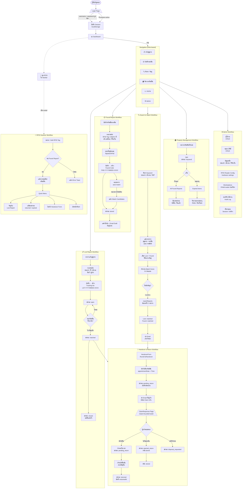
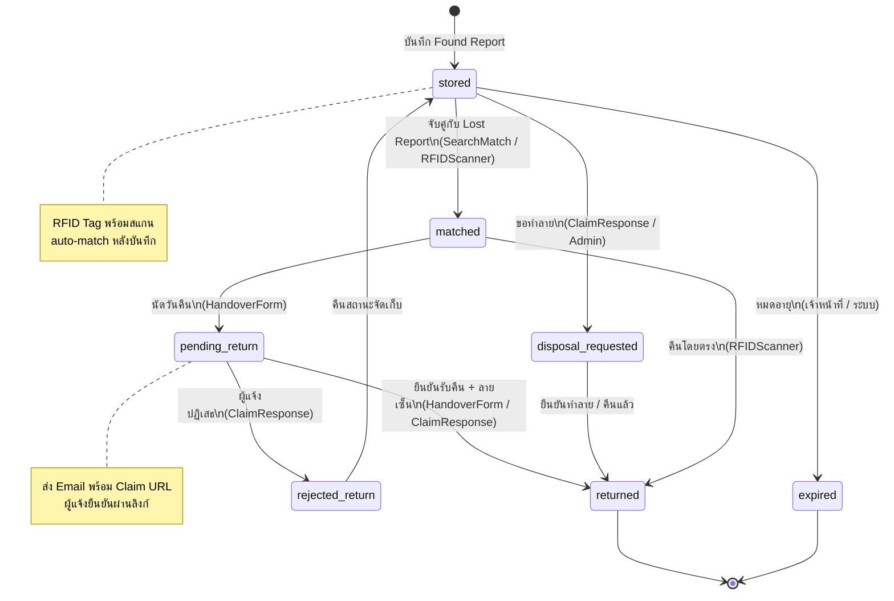
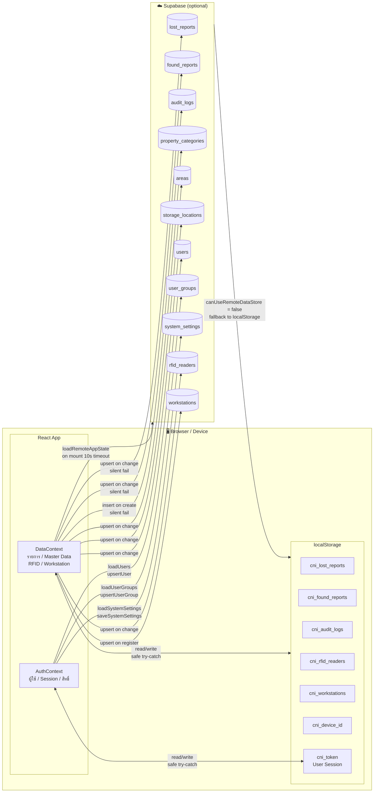
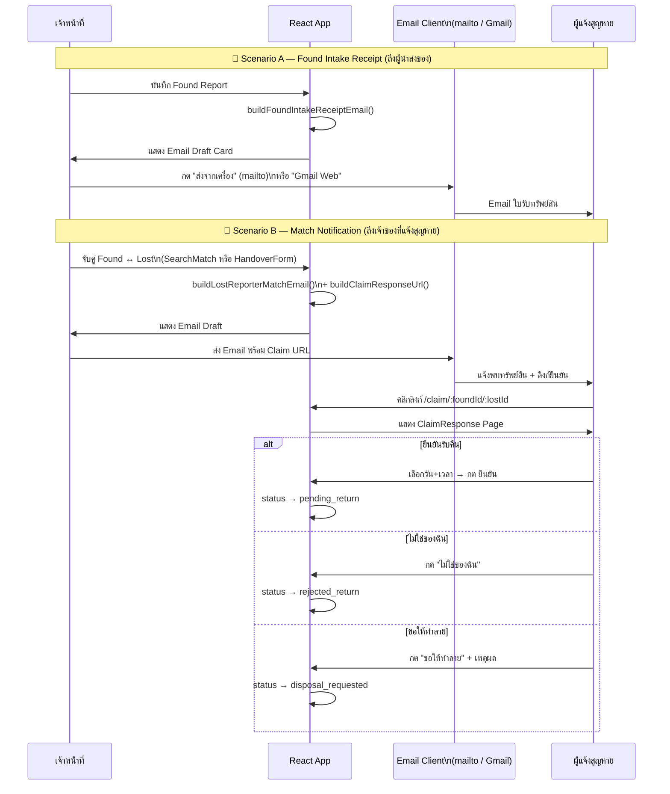
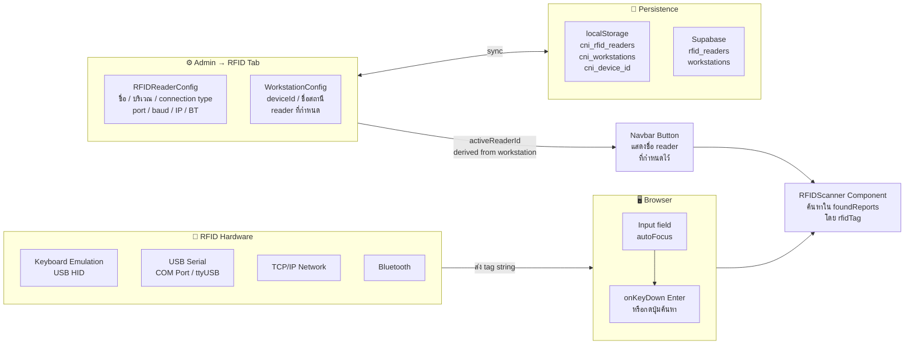

# CNI Lost & Found — System Workflow (Current)

---

## 1. Main System Flow

---

## 2. Property Status State Machine

---

## 3. Data Architecture

---

## 4. Email Notification Flow

---

## 5. RFID Hardware Integration

