# CNI Lost & Found — Workflow & Data Flow
### เปรียบเทียบ TOR (ข้อกำหนดขอบเขตงาน) vs การทำงานปัจจุบัน

> **TOR อ้างอิง:** ข้อกำหนดขอบเขตงาน จ้างพัฒนาระบบทรัพย์สินที่ถูกพบและสูญหาย ของคลิกเน็กซ์ อินโนเวชั่น V.1.0 (24/04/2569)  
> ระยะเวลาดำเนินงาน: **240 วัน**

| สัญลักษณ์ | ความหมาย |
|-----------|----------|
| ✅ | Implemented — ทำงานได้ครบตาม TOR |
| ⚠️ | Partial — ทำได้บางส่วน |
| ❌ | Not Yet — ยังไม่ได้พัฒนา |

---

## สรุปภาพรวม TOR vs ปัจจุบัน

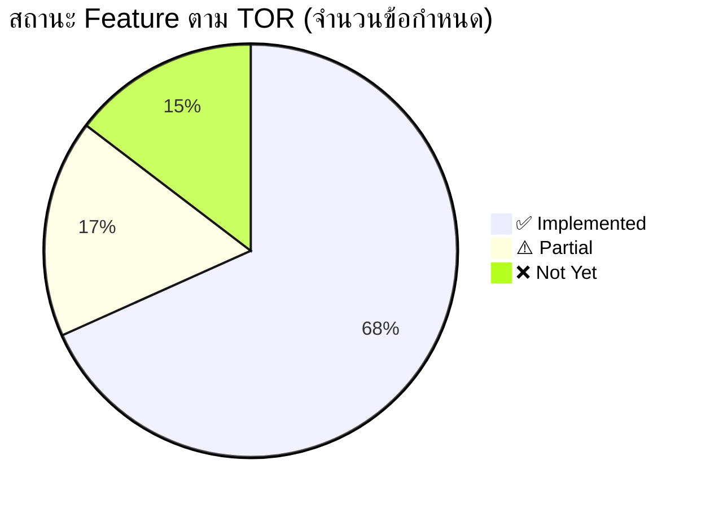

---

## 1. System Architecture

### As-Is (TOR กำหนด — ข้อ 4.3)
> ระบบต้องเป็น **Web-Based Application** ใช้งานผ่าน Web Browser แบบ **Responsive Design**  
> จากคอมพิวเตอร์ Tablet และ Mobile ได้เป็นอย่างน้อย

### To-Be (ปัจจุบัน)

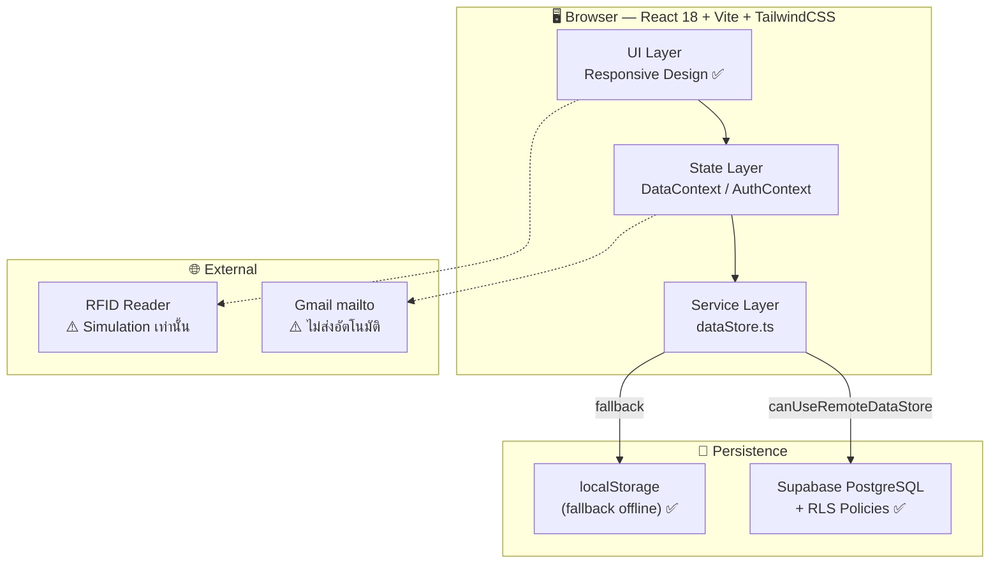

| ข้อ TOR | ข้อกำหนด | สถานะ | หมายเหตุ |
|---------|----------|-------|---------|
| 4.3 | Web-Based Application | ✅ | Vite + React 18 |
| 4.3 | ใช้ผ่าน Web Browser | ✅ | |
| 4.3 | Responsive Design (PC/Tablet/Mobile) | ⚠️ | PC ดี, Mobile ยังไม่ optimize เต็มที่ |

---

## 2. ฟังก์ชันรับแจ้งทรัพย์สินสูญหาย — Lost Report (ข้อ 4.4)

### As-Is (TOR กำหนด)

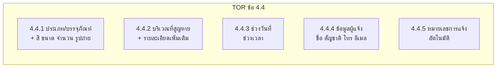

### To-Be (ปัจจุบัน — `/lost/new`)

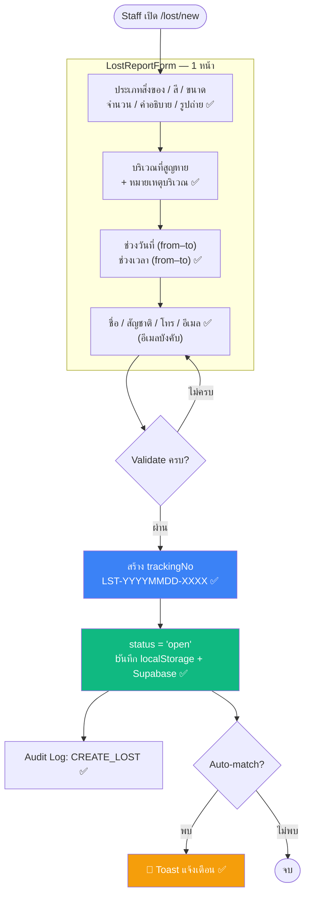

| ข้อ TOR | ข้อกำหนด | สถานะ | หมายเหตุ |
|---------|----------|-------|---------|
| 4.4.1 | เลือกประเภท + สี ขนาด จำนวน รูปถ่าย | ✅ | |
| 4.4.2 | เลือกบริเวณ + รายละเอียดเพิ่มเติม | ✅ | |
| 4.4.3 | ช่วงวันที่ + ช่วงเวลา | ✅ | |
| 4.4.4 | ชื่อ สัญชาติ โทร อีเมล | ✅ | อีเมลเป็น required field |
| 4.4.5 | หมายเลขการแจ้งอัตโนมัติ | ✅ | format `LST-YYYYMMDD-XXXX` |

---

## 3. ฟังก์ชันนำส่งทรัพย์สินหลงลืม — Found Report (ข้อ 4.5)

### As-Is (TOR กำหนด)

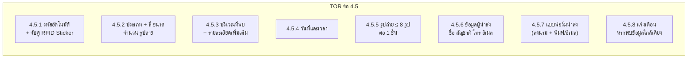

### To-Be (ปัจจุบัน — `/found/new` และ `/found/:id/intake`)

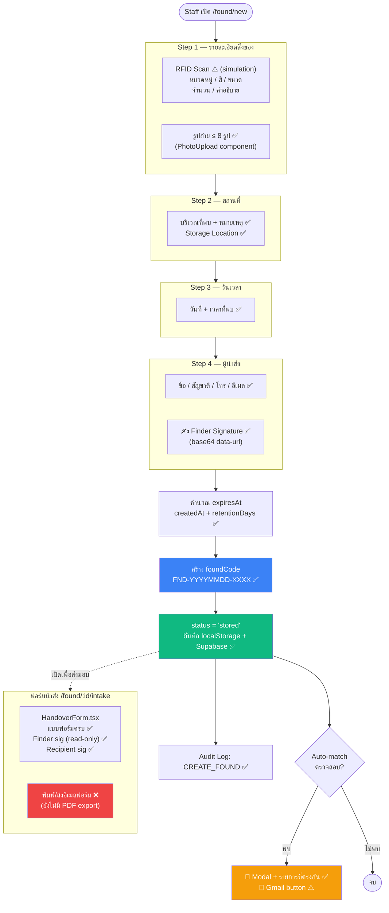

| ข้อ TOR | ข้อกำหนด | สถานะ | หมายเหตุ |
|---------|----------|-------|---------|
| 4.5.1 | รหัสอัตโนมัติ `FND-YYYYMMDD-XXXX` | ✅ | |
| 4.5.1 | จับคู่กับ RFID Sticker | ⚠️ | เก็บ rfidTag ได้ แต่ scan เป็น simulation |
| 4.5.2 | ประเภท + สี ขนาด จำนวน รูปถ่าย | ✅ | |
| 4.5.3 | บริเวณที่พบ + รายละเอียดเพิ่มเติม | ✅ | |
| 4.5.4 | วันที่และเวลา | ✅ | |
| 4.5.5 | รูปถ่าย ≤ 8 รูป ต่อ 1 ชิ้น | ✅ | PhotoUpload จำกัด 8 รูป |
| 4.5.6 | ชื่อ สัญชาติ โทร อีเมล (ผู้นำส่ง) | ✅ | |
| 4.5.7 | แบบฟอร์มนำส่ง — ลงนาม (Finder + Recipient) | ✅ | HandoverForm.tsx |
| 4.5.7 | สั่งพิมพ์/ส่งอีเมลแบบฟอร์มนำส่ง | ❌ | ไม่มี PDF export / ส่งอีเมลจริง |
| 4.5.8 | แจ้งเตือนหากพบข้อมูลใกล้เคียง (หน้าจอ) | ✅ | Toast + Modal |
| 4.5.8 | แจ้งเตือนทางอีเมลอัตโนมัติ | ❌ | มีแค่ Gmail mailto button |

---

## 4. ฟังก์ชันค้นหา/จับคู่ — Search & Match (ข้อ 4.6)

### As-Is (TOR กำหนด)
> ค้นหาจาก **ประเภท บริเวณ รายละเอียด วันที่/ช่วงเวลา** และแสดงรายละเอียดที่เกี่ยวข้อง

### To-Be (ปัจจุบัน — `/search`)

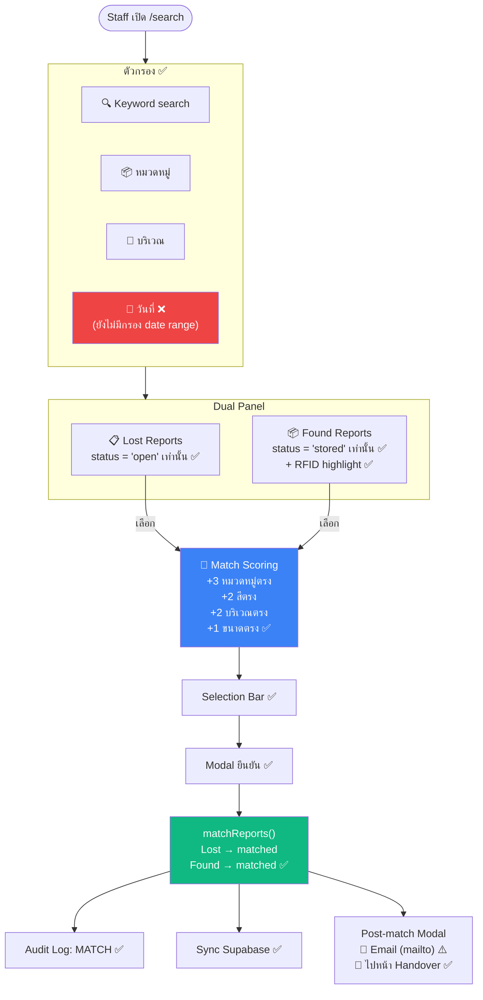

| ข้อ TOR | ข้อกำหนด | สถานะ | หมายเหตุ |
|---------|----------|-------|---------|
| 4.6.1 | ค้นหาจากประเภทของทรัพย์สิน | ✅ | |
| 4.6.1 | ค้นหาจากบริเวณที่พบ | ✅ | |
| 4.6.1 | ค้นหาจากรายละเอียดทรัพย์สิน | ✅ | keyword search |
| 4.6.1 | ค้นหาจากวันที่/ช่วงเวลาที่พบ | ❌ | ยังไม่มี date range filter |
| 4.6.2 | แสดงรายละเอียดที่เกี่ยวข้อง | ✅ | dual panel + scoring |

---

## 5. ฟังก์ชันการจัดการข้อมูลทรัพย์สิน — Property Management (ข้อ 4.7)

### As-Is (TOR กำหนด)

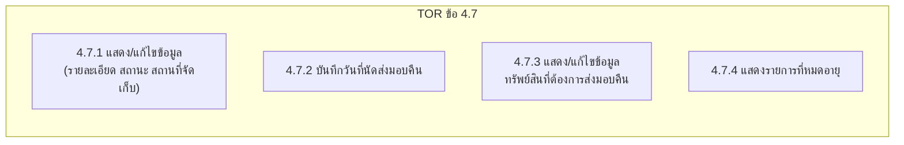

### To-Be (ปัจจุบัน — `/property`)

```mermaid
flowchart TD
    A([Staff เปิด /property]) --> TABS

    subgraph TABS["2 Tabs"]
        T1["📦 ทรัพย์สินทั้งหมด ✅\n(search + status filter)"]
        T2["⏰ หมดอายุ ✅\n(expired tab)"]
    end

    T1 --> ROW["แต่ละรายการ"]
    ROW --> MODAL["Modal จัดการ ✅"]

    subgraph MODAL_CONTENT["Modal Actions"]
        M1["ดูรายละเอียดครบถ้วน ✅"]
        M2["เปลี่ยนสถานะ ✅\nstored/matched/returned\nexpired/disposal_requested"]
        M3["บันทึกนัดหมาย (วันเวลา) ✅\nstatus → pending_return"]
        M4["ลิงก์ไปหน้า Handover ✅"]
    end

    MODAL --> MODAL_CONTENT

    subgraph STATUS_CHANGE["เมื่อเปลี่ยนสถานะ"]
        SC1["returned → บันทึก returnedAt ✅"]
        SC2["Sync Supabase ✅"]
        SC3["Audit Log ✅"]
    end

    M2 --> STATUS_CHANGE

    style M3 fill:#10B981,color:#fff
    style M4 fill:#3B82F6,color:#fff
```

| ข้อ TOR | ข้อกำหนด | สถานะ | หมายเหตุ |
|---------|----------|-------|---------|
| 4.7.1 | แสดง/แก้ไขข้อมูล (รายละเอียด สถานะ สถานที่) | ✅ | |
| 4.7.2 | บันทึกวันที่นัดส่งมอบคืน | ✅ | returnAppointment field |
| 4.7.3 | แสดง/แก้ไขข้อมูลที่ต้องส่งมอบคืน | ✅ | filter pending_return |
| 4.7.4 | แสดงรายการทรัพย์สินที่หมดอายุ | ✅ | Expired tab |

---

## 6. ฟังก์ชันแบบฟอร์มนำส่ง/ส่งมอบคืน — Handover Form (ข้อ 4.5.7)

### As-Is (TOR กำหนด)
> สร้างแบบฟอร์มนำส่งทรัพย์สินหลงลืม ประกอบด้วยข้อมูลผู้นำส่ง รายละเอียดทรัพย์สิน วันที่ เวลา บริเวณ  
> ให้**ผู้นำส่งและผู้รับลงนามร่วมกัน** + สั่งพิมพ์หรือส่งอีเมลได้

### To-Be (ปัจจุบัน — `/found/:id/handover`)

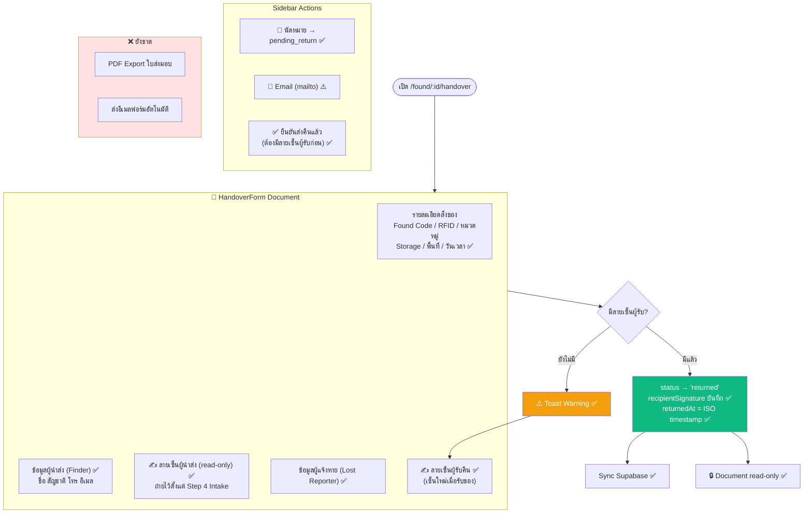

---

## 7. ฟังก์ชันการจัดทำรายงานและสถิติ — Reports & Statistics (ข้อ 4.8)

### As-Is (TOR กำหนด)
- **4.8.1** รายงานสถิติแจ้งหาย — รายวัน/เดือน/ปี แยกตามประเภท หรือบริเวณ
- **4.8.2** รายงานสถิตินำส่ง — รายวัน/เดือน/ปี แยกตามประเภท หรือบริเวณ
- **4.8.3** รายงานการปฏิบัติงาน — กรองจาก username/ช่วงเวลา แสดงการรับแจ้ง/นำส่ง/ส่งมอบ

### To-Be (ปัจจุบัน — `/reports`)

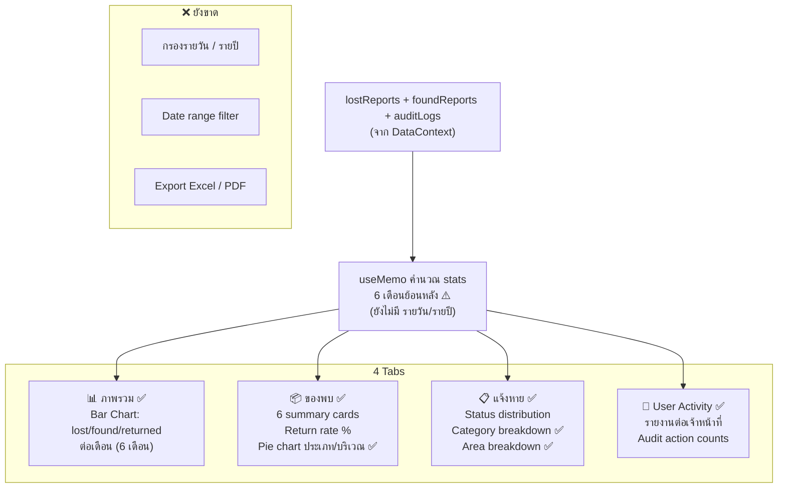

| ข้อ TOR | ข้อกำหนด | สถานะ | หมายเหตุ |
|---------|----------|-------|---------|
| 4.8.1 | สถิติแจ้งหาย รายเดือน | ✅ | 6 เดือนย้อนหลัง |
| 4.8.1 | สถิติแจ้งหาย รายวัน/รายปี | ❌ | |
| 4.8.1 | แยกตามประเภท/บริเวณ | ✅ | |
| 4.8.2 | สถิตินำส่ง รายเดือน | ✅ | |
| 4.8.2 | สถิตินำส่ง รายวัน/รายปี | ❌ | |
| 4.8.2 | แยกตามประเภท/บริเวณ | ✅ | |
| 4.8.3 | รายงานการปฏิบัติงาน (username) | ✅ | User Activity tab |
| 4.8.3 | กรองจากช่วงเวลา | ❌ | ดูเฉพาะ 6 เดือนล่าสุด |
| 4.8.3 | แสดงรับแจ้ง/นำส่ง/ส่งมอบ | ✅ | |

---

## 8. ฟังก์ชันผู้ดูแลระบบ — Admin (ข้อ 4.9)

### As-Is (TOR กำหนด — ข้อ 4.9.1 การกำหนดสิทธิ์)

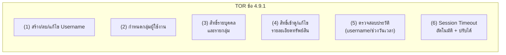

### To-Be (ปัจจุบัน — `/admin`)

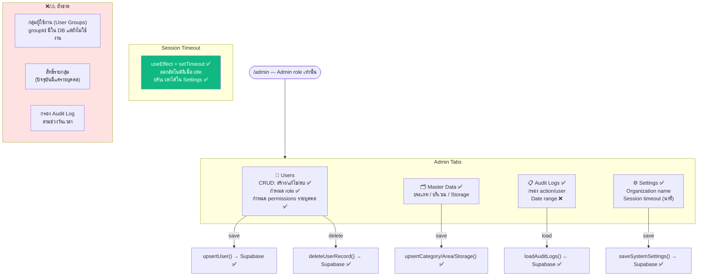

| ข้อ TOR | ข้อกำหนด | สถานะ | หมายเหตุ |
|---------|----------|-------|---------|
| 4.9.1(1) | สร้าง/ลบ/แก้ไข Username | ✅ | |
| 4.9.1(2) | กำหนดกลุ่มผู้ใช้งาน | ⚠️ | `groupId` เก็บใน DB แต่ UI ยังไม่ใช้ |
| 4.9.1(3) | สิทธิ์รายบุคคล | ✅ | PermissionMap 6 สิทธิ์ |
| 4.9.1(3) | สิทธิ์รายกลุ่ม | ❌ | ยังไม่ implement group permissions |
| 4.9.1(4) | สิทธิ์เข้าดู/แก้ไขทรัพย์สิน | ✅ | PermGuard บน routes |
| 4.9.1(5) | ประวัติการใช้งาน (username) | ✅ | Audit Logs tab |
| 4.9.1(5) | กรองตามช่วงวันเวลา | ⚠️ | กรอง action/user ได้ แต่ date range ไม่มี |
| 4.9.1(6) | Session Timeout อัตโนมัติ | ✅ | |
| 4.9.1(6) | ปรับเวลา Session Timeout ได้ | ✅ | Settings |

### As-Is (TOR กำหนด — ข้อ 4.9.2 Master Data)

| ข้อ TOR | ข้อกำหนด | สถานะ | หมายเหตุ |
|---------|----------|-------|---------|
| 4.9.2(1) | ประเภททรัพย์สิน (Property Category) | ✅ | CRUD + ชื่อ TH/EN + icon |
| 4.9.2(2) | อายุการจัดเก็บ (อาหาร 1วัน / อื่นๆ 1ปี) | ✅ | `retentionDays` per category |
| 4.9.2(3) | บริเวณที่สูญหาย/พบ | ✅ | Areas CRUD |
| 4.9.2(4) | สถานที่จัดเก็บ | ✅ | StorageLocations CRUD |

---

## 9. Status State Machine (สถานะทรัพย์สิน)

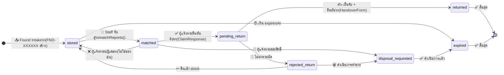

```mermaid
stateDiagram-v2
    direction LR
    note right of open : Lost Report\nStatus Flow

    [*] --> open : 📝 ผู้ใช้แจ้งหาย\n(LST-XXXXXX สร้าง)
    open --> matched : 🔗 Staff จับคู่
    matched --> open : ❌ ผู้แจ้งหายปฏิเสธ
    matched --> closed : 🚫 สละสิทธิ์\nหรือส่งคืนสำเร็จ
    closed --> [*]
```

---

## 10. Data Flow — Frontend ↔ Storage

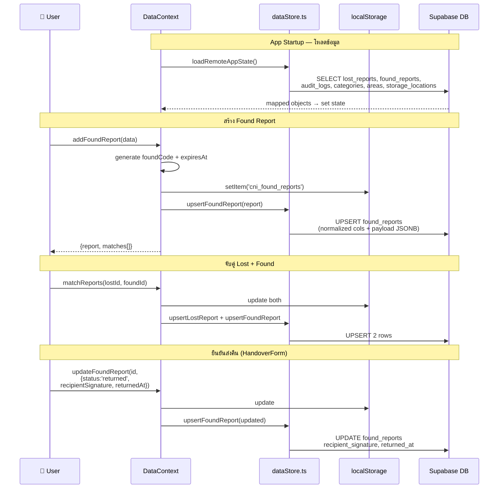

---

## 11. Route / Screen Map

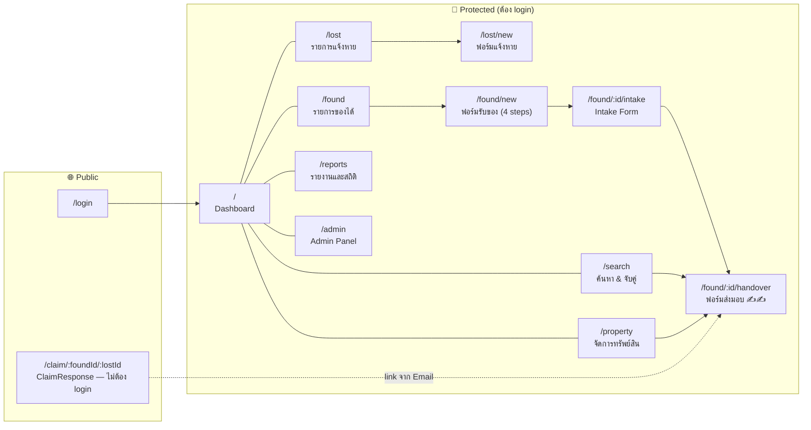

---

## 12. Gap Analysis — สรุปทุกข้อตาม TOR

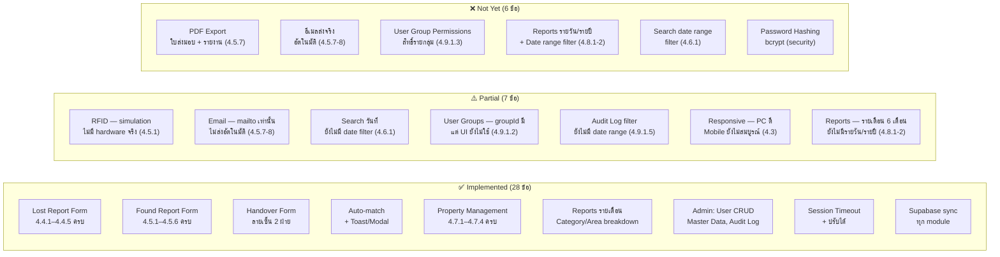

---

## 13. Phase 2 — แผนพัฒนาต่อตาม Priority

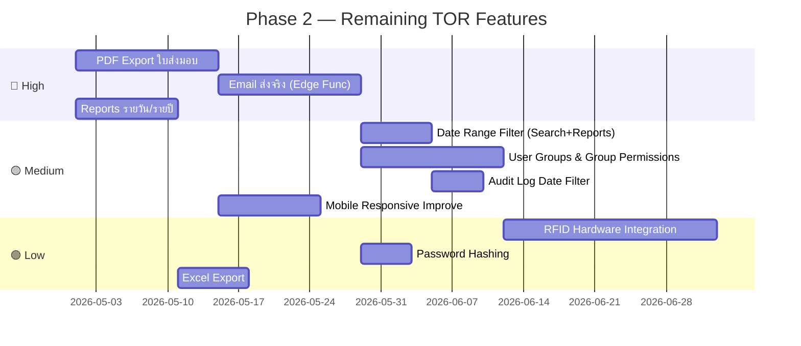

---

> **หมายเหตุ:** TOR ไม่ได้ระบุ Public Claim Response (`/claim`) แต่ระบบได้พัฒนาเพิ่มเติมเพื่อรองรับ UX ที่ดีขึ้น — ให้ผู้แจ้งหายตัดสินใจผ่าน link โดยไม่ต้อง login
